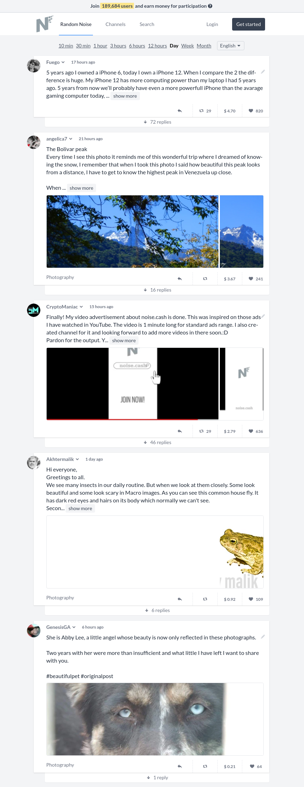

<!-- Logo and description part -->
<div align="center">

<p>
<br>
<br>
A bot for Noise.cash, noise.cash is a social platform just like Twitter which allows its [userbase] to earn bitcoin cash from tips for making short posts.
</p>
</div>

<!-- Requirement Badges -->
<!-- Python badge -->
<p align="center">
<a href="https://www.python.org/">

</a>
<!-- Selenium badge -->
<a href="https://www.selenium.dev/">

</a>
<!-- Chrome driver badge -->
<a href="https://chromedriver.chromium.org/downloads">

</a>
</p>

<!-- Disclaimer -->

### Disclaimer

I am not responsible for banned accounts, thermonuclear war, or you getting banned because you were using a bot in the first place. Please do some research if you have any concerns about how selenium automation works and noise.cash TOS. YOU are choosing to use this bot, and if you point the finger at me for getting you banned, I will laugh at you.

<!-- Description -->

## [Noise.Cash]('https://noise.cash/')



<!-- Star reminder -->

#### If you found this repo useful please don't forget to give me a :star:

### Installation

create a virtual environment with virtualenv

```bash
virtualenv env
```

Activate the virtual environment

```bash
source env/bin/activate
```

Install all the necessary packages

```bash
pip install -r requirements.txt
```

### Browser binary and driver configuration

This bot was made to be run on heroku 24/7 you can also run it on your local machine, for that follow these stesps:

#### Export your Browser binary path and your chromedriver path.

If you are running in heroku use the environment variable option to set CHROMEDRIVER_PATH and GOOGLE_CHROME_BIN.

else if you're running on a local machine change these lines in app.py

```python
def __init__(self, user, mail, pswd):
    self.user = user
    self.mail = mail
    self.pswd = pswd
    self.login_url = "https://noise.cash/login"
    self.wallet_url = "https://noise.cash/settings/wallet"
    self.chamber_url = [
        "https://noise.cash/n/url1",
        "https://noise.cash/n/url2",]
    self.driver = webdriver.Chrome(
        executable_path=str(os.environ.get("CHROMEDRIVER_PATH")), #set the path to your chrome driver here
        options=self._getOpts(),)
    self.driver.execute_script(
        "Object.defineProperty(navigator, 'webdriver', {get: () => undefined})")
    self.wait = WebDriverWait(self.driver, 10)
```

```python
# Experimental features
prefs = {"profile.managed_default_content_settings.images": 2}
opts.add_experimental_option("prefs", prefs)
opts.add_experimental_option("excludeSwitches", ["disable-popup-blocking"])
opts.add_experimental_option("excludeSwitches", ["enable-automation"])
opts.add_experimental_option("useAutomationExtension", False)
opts.set_capability("unhandledPromptBehavior", "accept")

# Chrome binary
opts.binary_location = os.environ.get("GOOGLE_CHROME_BIN") #replace with your browser path
```

### Different Browser

Say you want to use a different browser take Firefox example then change the following lines of code:

```python
self.driver = webdriver.Chrome( #replace with Firefox webdriver.Firefox()
    executable_path=str(os.environ.get("CHROMEDRIVER_PATH")),
    options=self._getOpts())
```

```python
def _getOpts(self):
    #opts = webdriver.ChromeOptions() replace with
    opts = webdriver.firefox.options.Options()
```

then replace the browser path with your firefox browser binary path and driver path with your gecko driver path.

### Using multiple accounts

If you want to use multiple accounts add those account usernames and emails to users.txt file

```
<account_username_1>,<account_mail_1> #this is the format
<account_username_2>,<account_mail_2>
<account_username_3>,<account_mail_3>
<account_username_4>,<account_mail_4>
```

here i'm assuming that you are using the same password for all the accounts, else you'll have to come up with a logic to map passwords to their respective mails.

### Rotating wallets

the bot can rotate wallets if you don't want to use the same bch address for multiple accounts. you can use different bch addresses by adding them to the wallets.txt file

```
bitcoincash:your_address_1
bitcoincash:your_address_2
```

adding bitcoinscash: before your address strings is necessary.

### Different Chambers

you can control which chambers the bot will post to by adding the link of that particular chamber to the chamber list

```python
self.chamber_url = [
        "https://noise.cash/n/url1",
        "https://noise.cash/n/url2",]
```

you can add as many chambers as you want

### Posts

You can provide the bot the contents that you want to post for example i'm trying to post famous Quotes and jokes, i have some json files consisting of some quotes and jokes you can use your own strings to post the procedure will almost be the same.

```json
[
  {
    "body": "Now I have to say \"Leroy can you please paint the fence?\"",
    "id": "5tz52q",
    "score": 1,
    "title": "I hate how you cant even say black paint anymore"
  },
  {
    "body": "Pizza doesn't scream when you put it in the oven .\n\nI'm so sorry.",
    "id": "5tz4dd",
    "score": 0,
    "title": "What's the difference between a Jew in Nazi Germany and pizza ?"
  },
  {
    "body": "...and being there really helped me learn about American culture. So I visited a shop and as I was leaving, the Shopkeeper said \"Have a nice day!\" But I didn't so I sued him.",
    "id": "5tz319",
    "score": 0,
    "title": "I recently went to America...."
  },
  {
    "body": "A Sunday school teacher is concerned that his students might be a little confused about Jesus, so he asks his class, \u201cWhere is Jesus today?\u201d\nBrian raises his hand and says, \u201cHe\u2019s in Heaven.\u201d\n\nSusan answers, \u201cHe\u2019s in my heart.\u201d\n\nLittle Johnny waves his hand furiously and blurts out, \u201cHe\u2019s in our bathroom!\u201d\n\nThe teacher is surprised by this answer and asks Little Johnny how he knows this.\n\n\u201cWell,\u201d Little Johnny says, \u201cevery morning, my Dad gets up, bangs on the bathroom door and yells \u2018Jesus Christ, are you still in there?'\u201d",
    "id": "5tz2wj",
    "score": 1,
    "title": "Brian raises his hand and says, \u201cHe\u2019s in Heaven.\u201d"
  },
  {
    "body": "He got caught trying to sell the two books to a freshman.",
    "id": "5tz1pc",
    "score": 0,
    "title": "You hear about the University book store worker who was charged for stealing $20,000 worth of books?"
  }
]
```

### Liking Stuff

the bot can like people's posts, it goes to a random chamber url in your chamber list and likes a particular number of posts, you can set how many likes are given out by the bot

```python
def likeShit(self):
    print("--- Liking stuff")
    for x in range(1, 21): #set the no of likes that you want to give here its 20 you can change it.
        likeBtnsXpaths = f'//*[@id="app"]/div/main/div/div/div[4]/div/div[{x}]/div/div[2]/div[2]/div[3]/div[8]/button'
        likeBtn = self.__getXEC(likeBtnsXpaths).click()

```

### Random Capitalization

noise.cash checks if your post was already posted and since we are using a finite number of jokes and quotes data and will be looping through it again and again it will cause problems, so we will randomly capitalize charcters in the paragraph.

```python
random_joke = self.getRandJoke()
random_joke = "".join(  #you can comment this line out if you do not want this to happen
    np.random.choice([str.upper, str.lower], p=[0.05, 0.95])(c)
    for c in random_joke)
```

### Random wallet change

if you provide multiple wallet addresses the bot will randomly change the addresses for the accounts

```python
def changeWallet(self):

    if self.driver.current_url != self.wallet_url:
        self.driver.get(self.wallet_url)

    rec = np.random.choice([True, False], p=[0.3, 0.7])
    curr_addr = self.__getXEP('//*[@id="cashaddr"]')
    curr_addr_val = curr_addr.get_attribute("value")

    if "bitcoincash" not in curr_addr_val:
        curr_addr.send_keys(self.Wallet())
        self.__getXEC(
            "/html/body/div/div/main/div/div/div[2]/div[2]/div/div[2]/button"
        ).click()
        print("--- Changed wallet address")

    elif bool(rec):
        curr_addr = self.__getXEP('//*[@id="cashaddr"]')
        curr_addr.send_keys(Keys.CONTROL + "a")
        curr_addr.send_keys(Keys.DELETE)

        curr_addr.send_keys(self.Wallet())
        min_amount = self.__getXEP('//*[@id="minPayout"]').send_keys(0)
        self.__getXEC(
            "/html/body/div/div/main/div/div/div[2]/div[2]/div/div[2]/button"
        ).click()
        print("--- Changed wallet address")
```

### Account passwords

assuming you have a single password for every account you can set a password by editing the following line

```python
with open("users.txt", "r") as f:
        users = f.readlines()
    while True:
        for user in users:
            user = user.split("\n")[0].split(",")
            try:
                bot = NoiseCash(user[0], user[1], <your_password>) #your common password
                bot.Login()
```

else if you have different passwords for different account you can come up with your own logic for that.

### Sleep

the bot by default will not sleep and will continue posting stuff, you can control the behaviour by adding timeouts

```python
bot.changeWallet()
    bot.Logout()
    bot.Close()
    time.sleep(60*<mins>) #add this line and replace mins with how many mins you want the bot to sleep
except Exception as e:
    print(f"--- Error {e}")
    bot.Close()
```

### Heroku

if you want to upload this bot to Heroku a procfile has been provided you just need to set the environment variables and the necessary packages for it to work.

### Finally

sorry for the messy looking code this bot was developed within a short span of time, and i was not able to clean it up much hope you guys don't mind.

### Contributions

Feel free to contribute to this project and help me improve it.
